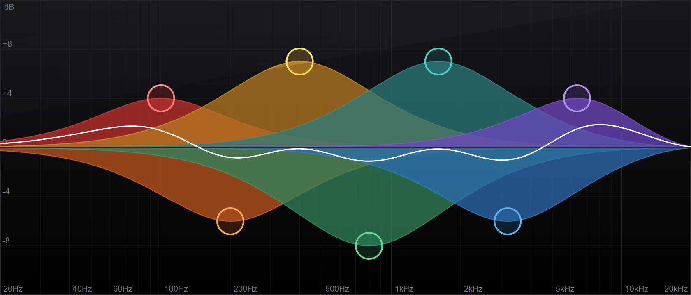

# DSSSP

[](https://www.npmjs.com/package/dsssp)
[](https://www.npmjs.com/package/dsssp)
[](https://www.npmjs.com/package/dsssp)

## React Library for Audio Processing and Visualization

[DSSSP](https://dsssp.io) is a React component library for visualizing and managing audio filters. These components are designed to serve as the core UI elements of audio editing tools and interfaces, enabling users to interactively configure all filter parameters. Essentially, it is a conversion of proprietary audio processing and visualization tools from professional desktop software to a web-based environment.

The library's rendering system is based on SVG and provides a logarithmic frequency graph for audio spectrum representation, a set of components to render and manipulate biquad filters, and mathematical functions to calculate the resulting signal curve. Filters support drag-and-drop interactions, direct property updates (**gain**, **frequency**, **Q-factor**), and implement common audio filter types.

## Installation

Install the package in your project directory with:

```bash
npm install dsssp
```

## Documentation

Visit [dsssp.io/docs](https://dsssp.io/docs/) to view the full documentation.

## Examples

Our documentation includes a full-scale [demo project](https://numberonebot.github.io/dsssp-demo/) that showcases each library component across various use cases and provides a starting point for your own projects.

## Licensing

This project is licensed under the [GNU AGPL-3.0 License](LICENSE), which ensures that any modifications or use of this library in networked services must be shared under the same license.

### Contact

If you have any questions, feedback, or would like to discuss commercial licensing, please reach out to the author at [alex.strelets@gmail.com](mailto:alex.strelets@gmail.com).
